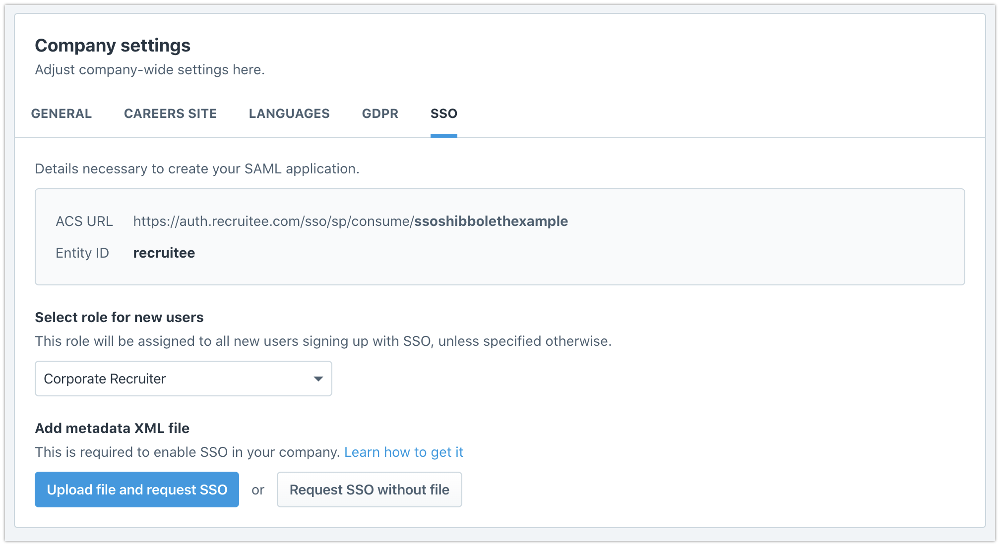
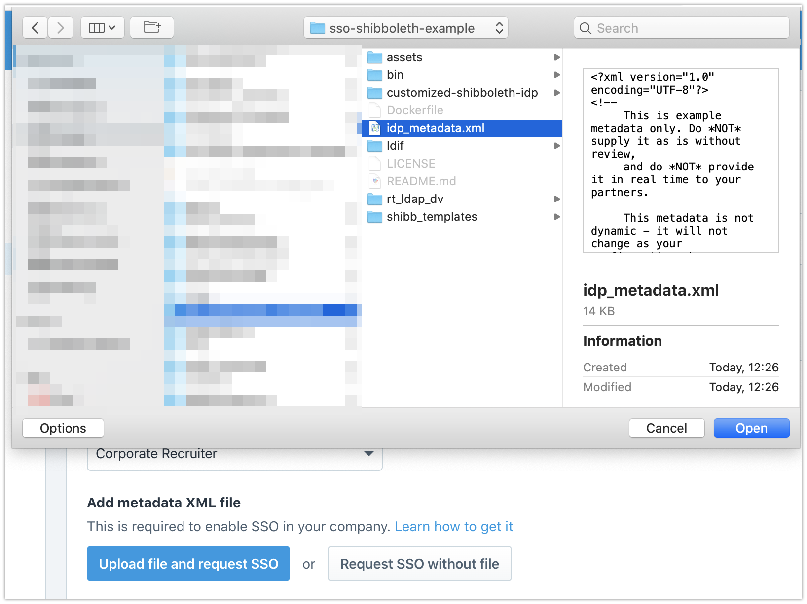
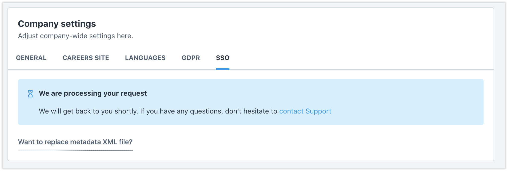
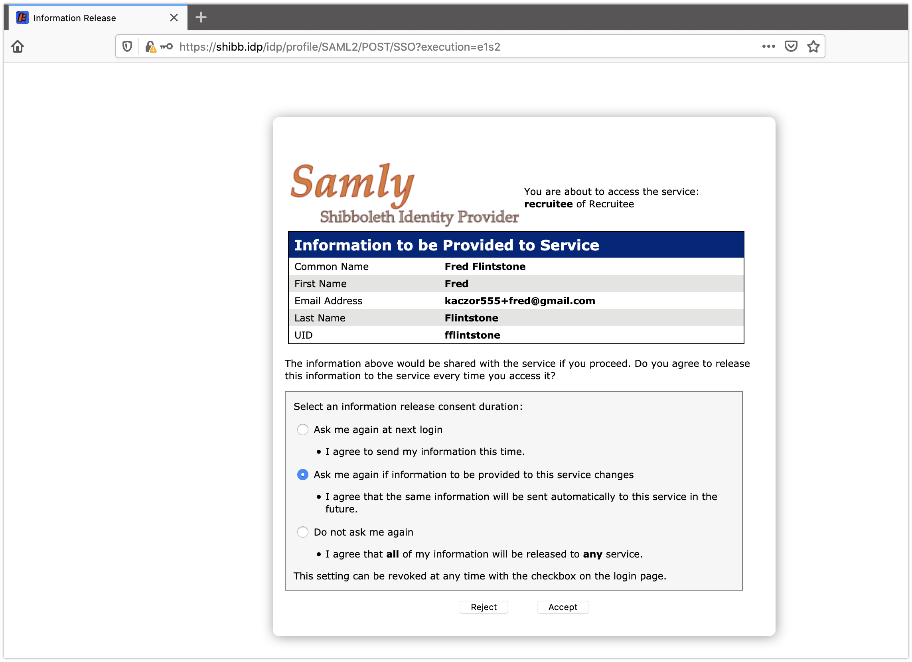
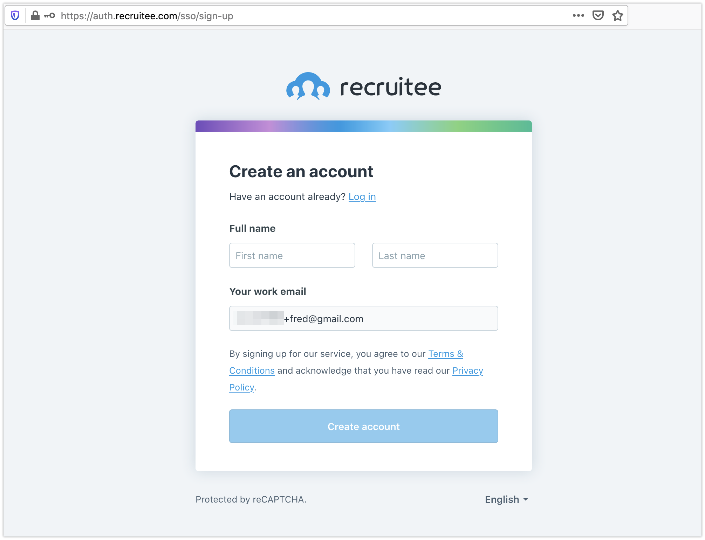

A Docker based Shibboleth SAML Identity Provider backed by user repository in OpenLDAP (for development and learning purposes only, not for production use).

# Links

- https://support.recruitee.com/en/articles/2923167-single-sign-on-sso-overview

# Requirements

- Docker

# Setup

```sh
sudo vim /etc/hosts
```

Add this line:

```
127.0.0.1 shibb.idp
```

```sh
git clone git@github.com:Recruitee/sso-shibboleth-example.git
cd sso-shibboleth-example
vim ldif/add_users.ldif
```

Add email addresses you have access to, to at least one of the users. Confirming your email address is a required part of signing up in Recruitee.

```sh
bin/start_shibb_ldap.sh
bin/1_setup_shibb_idp.sh
```

Accept the defaults when prompted for inputs for

- Hostname `[shibb.idp]`,
- SAML EntityID: `[https://shibb.idp/idp/shibboleth]`,
- Attribute Scope: `[idp]`.

When prompted for passwords use any non-empty password. Write it down.

```sh
vim customized-shibboleth-idp/ext-conf/idp-secrets.properties
```

Write down the password previously set to `jetty.backchannel.sslContext.keyStorePassword=`.

```sh
bin/2_build_image.sh
bin/3_start_shibb_idp.sh
```

You can look up the logs.

```sh
docker logs rt_shibb_idp -f
```

Ultimately, you should see a line similar to this:

```log
10:07:15.476 - INFO [org.eclipse.jetty.server.Server:419] - Started @10047ms
```

Save the `idp_metadata.xml`.

```sh
wget --no-check-certificate -O idp_metadata.xml https://shibb.idp/idp/shibboleth
```

Contact your company support manager if you'd like to test this on a separate company before enabling it on your main one.

Sign in to Recruitee, visit https://app.recruitee.com/#/settings/company/sso and upload the `idp_metadata.xml` file by clicking "Upload file and request SSO".







Contact our support to enable the SSO. We'll send you a link to our `sp_medata.xml` file.

```sh
wget -O sp_metadata.xml "https://auth.recruitee.com/sso/sp/metadata/ssoshibbolethexample?token=xxx"
cp sp_metadata.xml customized-shibboleth-idp/metadata/
bin/4_stop_shibb_idp.sh
bin/2_build_image.sh
bin/3_start_shibb_idp.sh
```

The configuration should be ready and you should be able to sign in. Visit the SSO sign-in link: https://auth.recruitee.com/sso/sign-in and fill your domain, or use the link with pre-filled domain (example: https://auth.recruitee.com/sso/sign-in/ssoshibbolethexample).

You will be redirected to https://shibb.idp to sign in. Sign in as Fred with `fflintstone:changeme` credentials. Accept the information to be provided to service:



If an account with this email doesn't exist, you will be asked to sign up. Otherwise, you will be signed in.



# Start over

If you want to start over you need to stop the servers, remove generated files, and remove any Docker containers created in this process.

```sh
bin/5_delete_shibb_idp.sh
rm -rf customized-shibboleth-idp/
rm -rf rt_ldap_dv/
docker stop $(docker ps --filter name=rt_ldap --format "{{.ID}}") | xargs docker rm
docker system prune
```

# Todo

- [ ] Send over `first_name` and `last_name` attributes.
- [ ] Don't require password inputs in `bin/1_...` step, hard-code any password.
